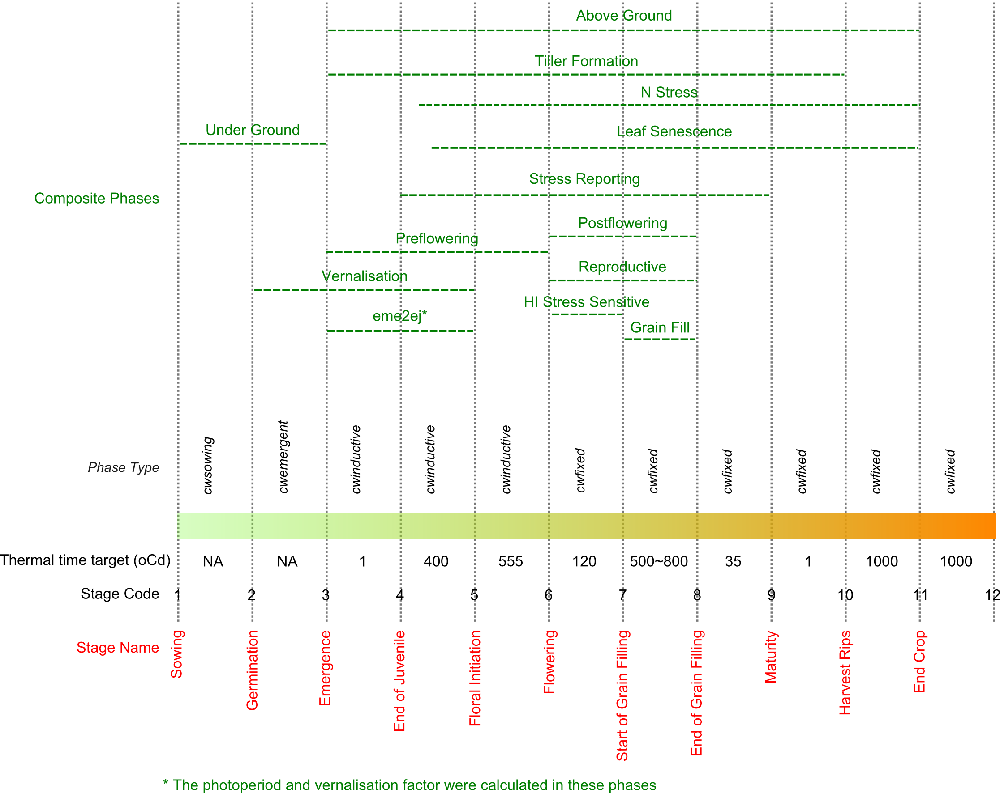

```{r setup, echo=FALSE, warning=FALSE, message=FALSE } 


library(knitr)
source('Rcode/wdVisXY.R')
source('Rcode/wdFunctions.R')
opts_chunk$set(fig.align='center', fig.show='hold',     
	cache=FALSE, echo=FALSE, warning=FALSE, message=FALSE,
	dev = 'png',dpi=300,
	fig.pos='H',out.width="100%") 
options(replace.assign=TRUE,width=90)
library(lattice)
trellis_default <- trellis.par.get()
trellis_default$fontsize$text <- 8
trellis_default$fontsize$points <- 8
trellis.par.set(trellis_default)
library(XML)
wheat_xml <- xmlInternalTreeParse('wheat.xml')

```


# Phenology


There are 11 phases in APSIM-Wheat module (Fig. \@ref(fig:PhenologWheatModule)).
The timing of each phase (except from sowing to germination, which
is driven by sowing depth and thermal time) is determined by the accumulation
of thermal time ($TT$) adjusted for other factors which vary with
the phase considered (e.g. vernalisation, photoperiod, N). The length
of each phase is  determined by a fixed thermal time (`thermal
time target`), which is specified by  tt_< phase_name>
in wheat.xml. Most parameters of thermal time targets are cultivar-specific.


## Thermal time calculation\label{par:Thermal-time}


The daily thermal time ($\Delta TT$) is calculated from the daily
average of maximum and minimum crown temperatures, and is adjusted
by genetic and environmental factors. Hence, the duration of phases
between emergence and floral initiation is adjusted for photoperiod
and vernalisation, using the cultivar-specific parameters `photoperiod
factor` ($f_{D}$, Equation \@ref(eq:PhotoperiodFactor)) and `vernalisation
factor` ($f_{V}$, Equation \@ref(eq:VernalisationFactor)). Other environmental
factors include soil water stress ($f_{W,\,pheno}$, Equation \@ref(eq:SoilWaterStress)),
 nitrogen stress ($f_{N,\,pheno}$, Equation \@ref(eq:NitrogenStress))
and phosphorus stress ($f_{P,\,pheno}$,  Section @ref(Phosphorus-stress))
in all phases except from Sowing to Emergence (See details below),
but they are all parametrized to have to effect in the current released
APSIM-Wheat. All factors are bound from 0 to 1. 


```{r PhenologWheatModule, fig.cap="Phenology in the APSIM_Wheat module. Targets are expressed in adjusted thermal time and are cultivar-specific parameters. The values given for the reference genotype Hartog."}





```


Crown temperatures are simulated according to the original routines
in CERES-Wheat and correspond to air temperatures for non-freezing
temperatures. The maximum and minimum crown temperatures
($T_{cmax}$ and $T_{cmin}$) are calculated according to the maximum
and minimum air temperature ($T_{max}$ and $T_{min}$), respectively.

\begin{equation}

T_{cmax}=\begin{cases}
2+T_{max}(0.4+0.0018(H_{snow}-15)^{2}) & \quad T_{max}<0\\
T_{max} & \quad T_{max}\geq0
\end{cases} (\#eq:CrownMaxTemperature)

\end{equation}


\begin{equation}

T_{cmin}=\begin{cases}
2+T_{min}(0.4+0.0018(H_{snow}-15)^{2}) & \quad T_{min}<0\\
T_{min} & \quad T_{min}\geq0
\end{cases} (\#eq:CrownMinTemperature)

\end{equation}

where $H_{snow}$ is the snow depth (cm). The default value of $H_{snow}$
is set to zero in the source codes (Fig. \@ref(fig:wdCrownTemperature)).
For more detail information about Equation \@ref(eq:CrownMaxTemperature)
and Equation \@ref(eq:CrownMinTemperature), please see the function\textbf{
}\texttt{CWVernalPhase::vernalisation} in the APSIM code.


```{r wdCrownTemperature,fig.cap='Crown temperature ($T_{c}$) in response to air temperature ($T$) for different snow depth ($H_{snow}$) in APSIM-Wheat. In the released APSIM version, $H_{snow}$ equals zero cm.' }  

p <- wdCrownTemperature()
print(p)  

```


The daily crown mean temperature ($T_{c}$) is calculated by the maximum
($T_{cmax}$) and minimum ($T_{cmin}$) crown temperature.


\begin{equation}

T_{c}=\frac{T_{cmax}+T_{cmin}}{2}

\end{equation}


Daily thermal time ($\Delta TT$) is calculated based on daily mean
crown temperature, using three cardinal temperatures (Fig. \@ref(fig:wdThermalTime)).
The default values of the cardinal temperatures and relative thermal
time are specified by x_temp (0, 26, 34) and y_tt (0, 26, 0), respectively,
in the wheat.xml (Fig. \@ref(fig:wdThermalTime)). Other crop modules
in APSIM calculate thermal time every 3 hours.


\begin{equation}

\Delta TT=\begin{cases}
T_{c} & \quad0<T_{c}\leq26\\
\frac{26}{8}(34-T_{c}) & \quad26<T_{c}\leq34\\
0 & \quad T_{c}\leq0\;\text{or}\;T_{c}>34
\end{cases} (\#eq:thermaltime)

\end{equation}


```{r wdThermalTime,fig.cap='Daily thermal time ($\\Delta TT$) in response to daily crown temperature ($T_{c}$) in APSIM-Wheat.' }  

p <- wdVisXY(wheat_xml, 
		"x_temp", "y_tt",
		xlab = expression(paste("Crown Temperature", ~"("*degree*"C)")),
		ylab = expression(paste("Thermal Time", ~"("*degree*"Cd)"))) 
print(p)

```


For each phenological stage, the daily thermal time ($TT^{\prime}$)
is summed from the start of phase and can be reduced by photoperiod
($f_{D}$, Equation \@ref(eq:PhotoperiodFactor)) and vernalisation factor
($f_{V}$, Equation \@ref(eq:VernalisationFactor)) and also dependent on
environmental factors (photoperiod and temperature). The environmental
factors include soil water stress ($f_{W,\,pheno}$, Equation \@ref(eq:SoilWaterStress)),
nitrogen stress ($f_{N,\,pheno}$, Equation \@ref(eq:NitrogenStress)) and
phosphorus stress ($f_{P,\,pheno}$,  Section @ref(Phosphorus-stress)).
The next phenological stage occurs when this adjusted thermal time
($TT^{\prime}$ in Equation \@ref(eq:CumThermalTime)) reaches the `target
thermal time` for the stage considered Fig. \@ref(fig:PhenologWheatModule).

\begin{equation}

TT^{\prime}=\sum[\Delta TT\times\min(f_{D},\;f_{V})\times\min(f_{W,\,pheno},\:f_{N,\,pheno},\;f_{P,\,pheno})] (\#eq:CumThermalTime)

\end{equation}

In the current released version, soil water, nitrogen and phosphorus
stresses have no effect on phenological development (i.e. parameters
$f_{W,\,pheno}=f_{P,\,pheno}=1$ Equation \@ref(eq:SoilWaterStress), and
$f_{N,\,pheno}$ has values typically above 1 Equation \@ref(eq:NitrogenStress)).
So, Equation \@ref(eq:CumThermalTime) is reduced to 


\begin{equation}

TT^{\prime}=\sum[\Delta TT\times\min(f_{D},\;f_{V})] (\#eq:CumThermalTime2)

\end{equation}


In the output variables of wheat module, $TT^{\prime}$ from the start
of each phase is named as `ttafter< phasename> `.
For example, the output variable `ttaftersowing` is not the actual
thermal time after sowing, but the thermal time adjusted for genetic
and environmental factors.


## Sowing-germination phase


The seed germination is determined by soil water availability in the
seeded layer (specified by `pesw_germ` with default value
0 mm). The crop will die if germination has not occurred before a
certain period, defined by `days_germ_limit` in wheat.xml,
which has a default value of 40 d.


## Germination-emergence phase


The germination to emergence phase includes an effect of the depth
of sowing ($D_{seed}$) on the thermal time target. The phase is comprised
of an initial period of fixed thermal time during which shoot elongation
is slow (the  lag phase, $T_{lag}$)
and a linear period, where the rate of shoot elongation ($r_{e}$,
C d mm$^{-1}$) towards the soil surface is linearly related to air
temperature. Then, the period of emergence ($T_{emer}$) is calculated
by 

\begin{equation}

T_{emer}=T_{lag}+r_{e}D_{seed} (\#eq:Emergence)

\end{equation}


The crop will die if emergence has not occurred before a certain period,
defined by `tt_emerg_limit` in wheat.xml, which has a default
value of 300$^{\circ}\text{C}$ d.

Most studies on seedling germination have simply recorded the accumulated
thermal time between germination and 50\% emergence from a given sowing
depth. For the purposes of model parametrization the value of $T_{lag}$
(`shoot_lag`) has been assumed to be around 40 $^{\circ}\text{C}$
d, while $r_{e}$ (`shoot_rate`) has been derived from studies
where thermal time to emergence was measured and where sowing depth
was known and it is set to 1.5 $^{\circ}\text{C}$ d per mm. This
means that at a sowing depth of 40 mm emergence occurs 100$^{\circ}\text{C}$
d after germination ($40+1.5\times40$).

There is the capability of increasing the time taken to reach emergence
due to a dry soil layer in which the seed is germinating, through
the relationship between `fasw_emerg` and `rel_emerg_rate`.
Currently this effect is  turned off
in the Wheat.xml file.


## Photoperiod impact on phenology


Photoperiod is calculated from day of year and latitude using standard
astronomical equations accounting for civil twilight using the parameter
twilight, which is assumed to be -6$^{\circ}$ (civil twilight) in
wheat.xml. Twilight is defined as the interval between sunrise or
sunset and the time when the true center of the sun is 6$^{\circ}$
below the horizon. Other crop modules of APSIM have used -2.2$^{\circ}$
as twilight parameters. In APSIM, the photoperiod affects phenology
between emergence and floral initiation (Fig. \@ref(fig:PhenologWheatModule)).
During this period, thermal time is affected by a photoperiod factor
($f_{D}$ in Equation \@ref(eq:CumThermalTime) and Equation \@ref(eq:CumThermalTime2))
that is calculated by

\begin{equation}

f_{D}=1-0.002R_{p}(20-L_{P})^{2} (\#eq:PhotoperiodFactor)

\end{equation}

where $L_{P}$ is the day length (h), $R_{P}$ is the sensitivities
to photoperiod which is cultivar-specific and is specified by `photop_sens`
in wheat.xml. The default value of $R_{P}$ is 3 (Fig. \@ref(fig:wdPhotoperiod)).


```{r wdPhotoperiod,fig.cap='Relationship between photoperiod factor ($f_{D}$) and day length ($L_{P}$) with different sensitivities to photoperiod ($R_{p}$). The default value of $R_{P}$ is 3.' }  

p <- wdPhotoPeriod()
print(p)  

```


## Vernalisation impact on phenology


In APSIM, vernalisation effects phenology between emergence and floral
initiation (Fig. \@ref(fig:PhenologWheatModule)). During this period,
thermal time is affected by a vernalisation factor ($f_{V}$ in Equation \@ref(eq:CumThermalTime)
and Equation \@ref(eq:CumThermalTime2)).

Vernalisation is simulated from daily average crown temperature ($T_{c}$),
daily maximum ($T_{max}$) and minimum ($T_{min}$) temperatures using
the original CERES approach (Fig. \@ref(fig:wdVernalisation)).

\begin{equation}

\Delta V=\min(1.4-0.0778T_{c},\:0.5+13.44\frac{T_{c}}{(T_{max}-T_{min}+3)^{2}})\quad\text{when, }T_{max}<30\,^{\circ}\text{C}\:\text{and}\,T_{min}<15\,^{\circ}\text{C}

\end{equation}


```{r wdVernalisation,fig.cap='Relationship between vernalisation ($\\Delta V$) and maximum ($T_{max}$) and minimum ($T_{min}$) temperature.' } 

p <- wdVernalisation()
print(p)  

```


Devernalisation can occur if daily $T_{max}$ is above 30 $^{\circ}\text{C}$
and the total vernalisation ($V$) is less than 10 (Fig. \@ref(fig:wdDevernalisation)).

\begin{equation}

\Delta V_{d}=\min(0.5(T_{max}-30),\:V)\quad\text{when, }T_{max}>30\,^{\circ}\text{C}\;\text{and}\;V<10

\end{equation}


```{r wdDevernalisation,fig.cap='Relationship between devernalisation ($\\Delta V_{d}$) and maximum temperature ($T_{max}$) when the total vernalisation ($V$) is less than 10.' } 

p <- wdDevernalisation()
print(p)  

```


The total vernalisation ($V$) is calculated by summing daily vernalisation
and devernalisation from Germination to Floral initiation (Composite
phase `Vernalisation` in Fig. \@ref(fig:PhenologWheatModule)).

\begin{equation}

V=\sum(\Delta V-\Delta V_{d})

\end{equation}

However, the vernalisation factor ($f_{v}$) is calculated just from
Emergence to Floral initiation (Composite phases \textbf{eme2ej} in
Fig. \ref{fig:PhenologWheatModule}).

\begin{equation}

f_{V}=1-(0.0054545R_{V}+0.0003)\times(50-V) (\#eq:VernalisationFactor)

\end{equation}

where $R_{V}$ is the sensitivities to vernalisation, which is cultivar-specific
and is specified by `vern_sens` in wheat.xml. The default
value of $R_{V}$ is 1.5 (Fig. \@ref(fig:wdVernalisationFactor)) 


```{r wdVernalisationFactor,fig.width=4,fig.height=4,fig.cap='Relationship between cumulated vernalisation ($V$) and vernalisation factor ($f_{V}$) and for different sensitivities to vernalisation ($R_{V}$). The default value of $R_{V}$ is 1.5.' } 

p <- wdVernalisationFactor()
print(p)  

```
