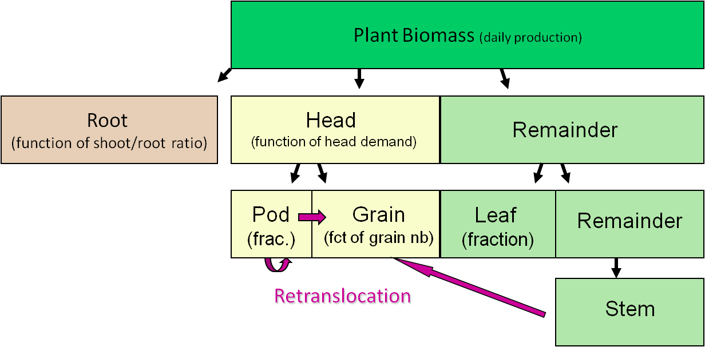

# Biomass partitioning and re-translocation


## Biomass partitioning


In the wheat module, wheat is divided into four components or parts:
`Root`, `Heat`, `Leaf` and `Stem` (Fig. \@ref(fig:WheatClassStructure)),
and is derived from a more generic plant module (meaning that it has
some parts not used or has a terminology, better adapted to other
crops). `Leaf` includes only leaf blades. `Stem` is
defined in a functional rather than a morphological manner and includes
plant stems, leaf sheaths and stem-like petioles (not applicable for
wheat). `Head` is divided into `Grain` and `Pod`
(which correspond to spike without the grain). Then grain are separated
into `Meal` and `Oil` (not used). The structure of wheat
parts is shown in Fig. \@ref(fig:WheatClassStructure). 

\begin{figure}[h]
\begin{centering}
\includegraphics[height=6cm]{figure/wdBiomassPartition}
\par\end{centering}
\caption{\label{fig:WheatClassStructure}}
\end{figure}


```{r WheatClassStructure, fig.cap="The hierarchical structure of wheat parts. Texts in the parentheses are classes of parts. The gray box indicates a plant part not used in wheat."}


knitr::include_graphics("figure/wdBiomassPartition.png")


```


On the day of emergence, biomass in plant parts (`Root`, `Head`,
`Leaf`, `Stem`, `Pod`, `Meal` and `Oil`)
are initialized by `root_dm_init` (set at 0.01 g plant\textsuperscript{-1}
in the wheat.xml file), `leaf_dm_init` (0.003 g plant\textsuperscript{-1}),
`stem_dm_init` (0.0016 g plant\textsuperscript{-1}), `pod_dm_init`
(0 g plant\textsuperscript{-1}), `meal_dm_init` (0 g plant\textsuperscript{-1}),
`oil_dm_init` (0 g plant\textsuperscript{-1}), respectively.
Daily biomass production (Equation \@ref(eq:actualBiomassProduction)) is
then partitioned to different plant parts in different ratios that
vary with crop stage. Overall, Root biomass are calculated with a
shoot:root ratio from the above-ground biomass ($\Delta Q$; Fig. \@ref(fig:BiomassPartition)).
Then the above-ground biomass are partitioned into the different plant
parts hierarchically, with biomass being attributed first to `Head`,
then `Leaf` and finally `Stem`. This means that all
parts might not have the biomass demand satisfied if the biomass production
is limited. 


```{r BiomassPartition, fig.cap="Biomass partition rules in the APSIM-Wheat module. Texts in the parentheses are partitioning methods of different organ types. The above-ground biomass is used to calculate Root biomass based on a shoot:root ratio, and is then partition to (1) Head based on the demand from Pod and Grain, and then (2) Leaf (proportion of the remaining biomass), and (3) Stem. Re-translocation occurs during grain filling, when the biomass accumulation doesn't satisfy Head demand. Biomass from Stem and Pod are then used to satisfy the Head demand (Pod and Grain)."}





```


## Biomass partitioning to `Root`


Firstly, some biomass are allocated to the root as a ratio of daily
available biomass ($\Delta Q$, Equation \@ref(eq:BiomassProduction)).
The so-called 'magic' fraction of biomass going to `Root` is
calculated from a stage-dependent function, but is independent on
pedo-climatic factors (Fig. \@ref(fig:wdroothootRatio)). All biomass
in the `Root` is considered as structural fraction, meaning
that it cannot be re-translocated to other parts later on.


\begin{equation}

\Delta Q_{root}=\Delta Q\times R_{Root:Shoot} (\#eq:RootBiomass)

\end{equation}

where $\Delta Q_{root}$ is the daily increment in `Root` biomass;
and $R_{Root:Shoot}$ is the ratio root:shoot biomass, which is defined
by x_sta`x_stage_no_partition` and `y_ratio_root_shoot`
in wheat.xml (Fig. \@ref(fig:wdroothootRatio)). 

\texttt{(}which is specified in wheat.xml ) 


```{r wdroothootRatio,fig.cap='Relationship between ratio of root and shoot and growth stage.' }  

p <- wdVisXY(wheat_xml, 
		"x_stage_no_partition", "y_ratio_root_shoot",
		xlab = "Stage",
		ylab = "Ratio of root and shoot")
print(p)

```


## Biomass partitioning to `Head` (`Pod`, \texttt{Meal

and \texttt{Oil }(not applicable in this version))}

Then all or part of available biomass ($\Delta Q$) are partitioned
into `Heads` according to total demand of `Heads` (`Meal`,
`Oil` and `Pod`). `Meal` and `Pod` demands
are calculated by Equation \@ref(eq:MealDemand) and Equation \@ref(eq:GrainDemand).
`Oil` demand always equals to zero in the current version of
the APSIM-Wheat module. Biomass directly partitioned in `Pod`
or `Grain` is considered as structural and cannot be re-translocated,
however the biomass providing from re-translocation is accumulated
as non-structural biomass. The `Pod` non-structural biomass
can then be re-translocated into `Grain` (See  Section @ref(Re-translocation)).


\begin{equation}

\begin{array}{c}
\Delta Q_{head}=\min(\Delta Q,\,D_{grain}+D_{pod})\\
\Delta Q_{grain}=\frac{D_{g}}{D_{head}}\Delta A_{head}\\
\Delta Q_{pod}=\frac{D_{p}}{D_{head}}\Delta A_{head}
\end{array} (\#eq:HeadBiomass)

\end{equation}

where $\Delta Q_{head}$ is the daily available biomass for `Head`,
$D_{head}$, $D_{grain}$and $D_{pod}$ are demands for `Head`,
`Grain` and `Pod`, respectively (see \autoref{sub:Grain-(meal)-demand}
and  Section @ref(Pod-demand)). $\Delta Q_{grain}$ and $\Delta Q_{pod}$
are biomass increment of `Grain` and `Pod`, respectively. 


## Biomass partitioning to `Leaf`


Then, the remaining biomass (after the partitioning to the `Heads`)
are partitioned into `Leaf` based on a stage dependent function
(Fig. \@ref(fig:wdFractionLeaf)). `Leaf` biomass is considered
as structural and thus cannot be re-mobilised.


\begin{equation}

\Delta Q_{leaf}=(\Delta Q-\Delta Q_{head})\times F_{leaf}

\end{equation}

where $\Delta Q_{leaf}$ is the daily increment in `Leaf` biomass;
and $F_{leaf}$ is the fraction of available biomass partitioned to
the leaf, which is defined by `x_stage_no_partition` and
`y_frac_leaf` in wheat.xml (Fig. \@ref(fig:wdFractionLeaf)). 


```{r wdFractionLeaf,fig.cap='Relationship between fraction of leafLeaf  and growth stage.' }  

p <- wdVisXY(wheat_xml, 
		"x_stage_no_partition", "y_frac_leaf",
		xlab = "Stage",
		ylab = "Fraction of leaf")
print(p)

```


## Biomass partitioning to `Stem`


Finally, the whole remaining biomass (if any) are partitioned into
`Stem` (Fig. \@ref(fig:BiomassPartition)). Until the stage `start
of grain filling`, 65\% of this biomass is distributed to structural
biomass (Fig. \@ref(fig:wdStemGrowthStructuralFractionStage)), while
remaining 35\% is allocated in un-structural biomass. Afterwards,
all new biomass allocated to `Stem` is for non-structural biomass
(which can re-mobilised).


\begin{equation}

\Delta Q_{stem}=\Delta Q-\Delta Q_{head}-\Delta Q_{leaf}

\end{equation}


\begin{equation}

\Delta Q_{stem.\,structural}=\Delta Q_{stem}\times h_{structual}

\end{equation}


\begin{equation}

\Delta Q_{stem.\,non-structural}=\Delta Q_{stem}\times(1-h_{structual}) (\#eq:StemNonStructural)

\end{equation}

where $\Delta Q_{stem}$ is the daily increment in `Stem` biomass;
$\Delta Q_{stem.\,structural}$ is the structural biomass of `Stem`;
$\Delta Q_{stem.\,non-structural}$ is the non-structural biomass
of `Stem`; and $h_{structual}$ is the fraction of `Stem`
biomass distributed to structural biomass which depends on the growth
stage (S). $h_{structual}$ is specified by `stemGrowthStructuralFraction`
and `stemGrowthStructuralFractionStage` in wheat.xml, with
a default value of 0.65 before beginning of grain filling and 0 after. 


```{r wdStemGrowthStructuralFractionStage,fig.cap='Relationship between fraction of structural and unstructural biomass in Stem.' }  

p <- wdStemGrowthStructuralFraction()
print(p)

```


## Re-translocation\label{subsec:Re-translocation}


If the supply in assimilate (daily biomass increase) is insufficient
to meet `Grain` demand, then re-translocation may occur to
meet the shortfall (Fig. \@ref(fig:BiomassPartition)). The biomass
re-translocation first occurs from the `Stem` non-structural
biomass. From the start of grain filling, the wheat module allows
a total re-translocation of up to 20\% of `Stem` biomass per
day. If required, biomass can then be re-translocated from the `Pod`
non-structural biomass. The re-translocated biomass is used to fulfill
the `Grain` and `Pod` demands (\autoref{sub:Grain-(meal)-demand}
and  Section @ref(Pod-demand)) and is accumulated as non-structural
biomass. 


\begin{equation}

D_{diff,\,head}=(D_{grain}-\text{\ensuremath{\Delta}}Q_{grain})+(D_{pod}-\Delta Q_{pod})

\end{equation}

where $D_{diff,\,head}$ is the unfulfilled demand from the plant,
$D_{grain}$ and $D_{pod}$ are the demands from `Grain` and
`Pod` (\autoref{sub:Grain-(meal)-demand} and  Section @ref(Pod-demand)),
and $\text{\ensuremath{\Delta}}Q_{grain}$ and $\Delta Q_{pod}$ are
the daily increments in biomass accumulated to `Grain` and
`Pod` (before re-translocation; Equation \@ref(eq:HeadBiomass)). 


\begin{equation}

\Delta Q_{retrans,\,stem}=\min(D_{diff},\,Q_{stem.\,non-structural}\times20\%)

\end{equation}

where $\Delta Q_{retrans,\,stem}$ is the dry biomass re-translocated
from `Stem`, and $Q_{stem.\,non-structural}$ is the non-structural
part of the `Stem` biomass (Equation \@ref(eq:StemNonStructural)).

\begin{equation}

D_{diff,\,head}=D_{diff,\,head}-\Delta Q_{retrans}

\end{equation}

where $D_{dff,\,head}$ is updated value of the unfulfilled demand
from the head. 

\begin{equation}

\Delta Q_{retrans,\,pod}=\min(D_{diff,\,head},\,Q_{pod,\,non-structural})

\end{equation}

where $\Delta Q_{retrans,\,pod}$ from pod is the dry biomass re-translocated
from `Pod`, and $Q_{pod,\,non-structural}$ is the non-structural
part of the `Pod` biomass. 

\begin{equation}

D_{dff,\,head}=D_{diff,\,head}-\Delta Q_{retrans,\,pod}

\end{equation}

where $D_{dff,\,head}$ is updated value of the unfulfilled demand
from the head. 

\begin{equation}

\Delta Q_{retrans}=\Delta Q_{retrans,\,stem}+\Delta Q_{retrans,\,pod}

\end{equation}

where $\Delta Q_{retrans}$ is re-translocated biomass within the
plant. 

\begin{equation}

\Delta Q_{grain.\,non-structural=}\Delta Q_{retrans\,to\,grain}=\frac{D_{diff,\,grain}}{D_{diff,\,head}}\Delta Q_{retrans}

\end{equation}


\begin{equation}

\Delta Q_{retrans\,to\,pod}=\frac{D_{diff,\,pod}}{D_{diff,\,head}}\Delta Q_{retrans}

\end{equation}


\begin{equation}

\Delta Q_{pod.\,non-structural=}\Delta Q_{retrans\,to\,pod}-\Delta Q_{retrans,\,pod}

\end{equation}

where $\Delta Q_{grain.\,non-structural}$ and $\Delta Q_{pod.\,non-structural}$
are the daily increment in the non-structural part of `Grain`
and `Pod` biomass; $\Delta Q_{retrans\,to\,grain}$ and $\Delta Q_{retrans\,to\,pod}$
to pod are the daily biomass re-translocated to `Grain` and
`Pod`; $D_{diff,\,grain}$ and $D_{diff,\,pod}$ are the unfulfilled
demand of `Grain` and `Pod`, which are calculated as
($D_{grain}-\Delta Q_{grain}$) and ($D_{pod}-\Delta Q_{pod}$), respectively. 


